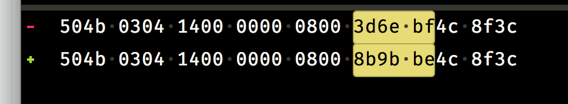

### *Zip File Inverstigate Report*

#### *Structure*
Overall .zip file format:

    [local file header 1]
    [file data 1]
    [data descriptor 1]
    . 
    .
    .
    [local file header n]
    [file data n]
    [data descriptor n]
    [archive decryption header] (EFS)
    [archive extra data record] (EFS)
    [central directory]
    [zip64 end of central directory record]
    [zip64 end of central directory locator] 
    [end of central directory record]

The detail:

Our problem is that the zip file can will ocntain the time when ziped file is least modified, this feature causes that different machines zip different zip files. For the purpose of using *erasure coding*, we need to make sure they are not different. The *time stamp* may be the break hole!
#### *Test*
Same file, just time stamp is different:

#### *Solution*
We find avary time stamp‘s previous code always "1400 0000 0800".

So we can find time stamps from binary code deponding on it. And then we change them to "0000 0000".
As a result, the time becomes "1979/11/30/12:00"